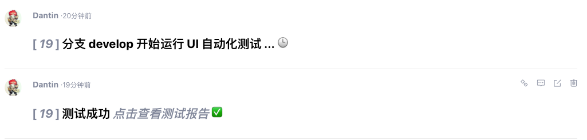

# 自动化测试框架

[TOC]

## 1.  概述

> 本项目为 shoplaza 自动化测试项目，包含自动化测试框架的选型以及所有的自动化测试用例


## 2. 项目结构&命名规范

```shell
├── README.MD								# README
├── lib										# 第三方库
│   └── ajaxListener.js
├── logs									# 标准日志文件(可删除，此处仅作用例参考)
│   ├── log.html
│   ├── output.xml
│   └── report.html
├── resources                               # 资源目录，存放底层测试库
│   ├── kw_kw_browser.robot						# 浏览器相关操作，打开/关闭 浏览器
│   ├── payment.robot
│   ├── shipping.robot
│   ├── kw_common.robot				# 登录相关操作，调用关键字完成指定用户登录
│   └── var_var_tax_price.robot						# 税费模块
├── module									# 按照模块区分测试用例
│   ├── 01_order							# 01_xx   一级菜单
│   │   ├── 01_checkout						# 01_xx   二级菜单
│   │   │   └── 001_checkout_list.robot		# 001_xx  实际用例
│   │   └── 02_payment
│   ├── 02_product
│   │   └── 01_material
│   ├── 03_customer
│   ├── 04_data
│   ├── 05_marketing
│   │   └── 01_discount
│   ├── 06_store
│   ├── 07_tools
│   └── 08_settings
│       └── 01_shipping
└── smoke									# 冒烟用例，为最基本用例，必须全部过
    └── 001_product_list.robot
```


### 2.1 基本概念说明

```shell
Library	              # 第三方库或者函数，如 robot 语法中执行的 py 文件
Variables             # Python 语法写的变量定义，定义到文件中，可以避免测试代码过于冗余
Resources             # 资源列表，具备某项功能的 keywords/variables 集合

External Resources    # 应该是全局的，待验证！

# 分类规则:
不同模块间的 suite 都用到了的变量/关键字，提取到 Resource 中
相同模块，不同 suite 之间使用的变量，放到模块的定义中(即 Directory 下的 __init__.robot)
相同模块，相同 suite 下的 test case 使用的变量，放到 suite 定义中(即 test_xxx.robot )
```


## 3. Robot Framework 框架安装

### 3.1 安装系统依赖 python 2.7

```shell
# 安装 python 2.7
brew install python@2

# mac 下面需要先删除自带的 python
brew uninstall python
rm -rf /Library/Frameworks/Python.framework/Versions/2.7
rm -rf "/Applications/Python 2.7"
rm -rf `ls -l /usr/local/bin | grep '/Library/Frameworks/Python.framework/Versions/2.7' `
brew prune
```


### 3.2 安装 RF 及 SeleniumLibrary

```shell
# 安装框架
pip install robotframework

# 安装测试库 selenium library
pip install --pre --upgrade robotframework-seleniumlibrary

# 下载谷歌浏览器驱动，并放到运行环境的 PATH 下面
https://sites.google.com/a/chromium.org/chromedriver/downloads
```


### 3.3 安装 RIDE (可选安装，只针对 Python2.x 环境)

> RIDE = RobotFramework IDE
>
> 是提供的一个用于编写测试用例的界面， 实现了语法高亮，错误检查，运行用例等功能
>
> 你也可以使用 sublime+plugin 或者其他 ide + plugin 的方式开发，详见参考文档；

```shell
# 安装 wxPython
#     wxPython 是 Python 非常有名的一个 GUI 库，因为 RIDE 是基于这个库开发的，所以这个必须安装
#     必须是 wxPython 2.8.12.1 版本，RIDE 基于该版本开发

# 下载 dmg 并安装
http://sourceforge.net/projects/wxpython/files/wxPython/2.8.12.1/

# 若安装过程失败，可使用如下方法手动安装
https://blog.csdn.net/TZJD89/article/details/72857961

# 安装 RIDE
pip install robotframework-ride

# 设置 python 默认使用 32 位来运行 wxPython,否则失败
defaults write com.apple.versioner.python Prefer-32-Bit -bool yes
```


### 3.4 其他依赖库

```bash
# pymysql  --  连接 mysql 数据库，获取验证码需要
pip install pymysql
pip install requests
```

#### 3.4.1 VIM 语法高亮插件

```shell
git clone git://github.com/mfukar/robotframework-vim.git
cp -rf robotframework-vim/* ~/.vim/
```


### 3.5 Linux 下使用 Selenium + Headless Chrome

```shell
# 下载包并安装，若存在依赖问题，则先安装依赖即可
sudo apt-get install libxss1 libappindicator1 libindicator7
wget https://dl.google.com/linux/direct/google-chrome-stable_current_amd64.deb
sudo dpkg -i google-chrome*.deb  # Might show "errors", fixed by next line
sudo apt-get install -f

# 测试是否可以运行
google-chrome --headless --no-sandbox --remote-debugging-port=9222 https://chromium.org --disable-gpu

# 下载 chromedriver , 即 操作 chrome 的 api, 注意需要使用 2.38 版本，其他的大多数不可用!!!!
# 其他版本报错如下：
Parent suite setup failed:
WebDriverException: Message: disconnected: unable to connect to renderer
  (Session info: headless chrome=67.0.3396.87)
  (Driver info: chromedriver=2.32.498513 (2c63aa53b2c658de596ed550eb5267ec5967b351),platform=Linux 4.4.0-82-generic x86_64)

# 安装 2.38 版本
wget https://chromedriver.storage.googleapis.com/2.38/chromedriver_linux64.zip
unzip chromedriver_linux64.zip
mv chromedriver /usr/local/bin
```

#### 3.5.1 linux 下截图显示方块的问题

> 现象：截图中，中文字体部分显示为方块
>
> 原因：没有安装中文字体导致，使用如下方法来检查和安装中文字体

```shell
# 安装字体检查工具，查看已安装的字体
apt-get -y install fontconfig xfonts-utils

# 查看系统中文字体
fc-list :lang=zh

# 安装中文字体
apt-get install fonts-droid-fallback ttf-wqy-zenhei ttf-wqy-microhei fonts-arphic-ukai fonts-arphic-uming
```


## 4. 用例规范说明

### 4.1 Test Suite 设置

```bash
*** Settings ***
Documentation     Test tax price page ui.					# 测试套件总体说明
Suite Setup       New Test Suite Browser And Login    		# 套件初始化动作
															#    -- 打开浏览器登录
															#    -- 构造初始测试数据
Suite Teardown    Close Test Suite Browser    				# 套件清理动作
															#    -- 清除构造的数据
															#    -- 关闭浏览器
Test Setup        Setup Test Case							# 用例初始化动作
															#    -- 跳转到首页开始测试
Test Teardown     Teardown Test Case						# 用例清理动作
															#    -- 关闭额外打开的窗口等
Resource          ../../../resources/kw_common.robot        # 导入封装的测试库关键字
Resource          ../../../resources/kw_kw_browser.robot	# 导入封装的测试库关键字
Resource          ../../../resources/var_tax_price.robot    # 导入封装的测试库关键字
```


## 5. 命令行运行测试用例

```shell
# 基本命令如下
robot test.robot

# 参数说明
# 1. 环境变量参数
ROBOT_OPTIONS					# 默认配置的 list
ROBOT_SYSLOG_FILE				# 系统日志文件
ROBOT_SYSLOG_LEVEL				# 系统日志级别
ROBOT_INTERNAL_TRACES			# 非空时，错误堆栈将包含方法调用

# 2. 命令行参数
-s								# 指定 suite name
-t								# 指定 test name
-v --variable					# 指定用例变量 -v str:hello  => ${str} = `hello`
-V --variablefile				# 指定变量文件 PATH
-d								# output dir
-o								# xml output file
-l								# log file
-r								# report file
-L								# log lever
-X								# 失败就停止
-P --pythonpath					# 指定 pythonpath，加载自定义的第三方包
--console 						# 结果输出格式
		 						# dotted: .表示成功 f表示一般用例失败 F表示重要用例失败
		 						# quiet:   除错误外，不输除任何东西
		 						# none:    不输出任何东西

```


## 6. 自动化测试集成 CI

> 对应到 flowci 中的流程为 RobotFramework
>
> 主要测试命令为: 

```shell
robot --outputdir logs \
      --pythonpath ./lib \
      --console dotted \
      -v is_headless:True \
      module/08_settings/03_tax_price
```

**评论效果如下图所示**




## 7. 使用教程

- [RF 入门教程](http://www.testclass.net/rf/)
- [RF 中文手册](https://jmcn.gitbooks.io/robotframework-cn/content/)
- [SeleniumLibrary 说明](https://github.com/robotframework/SeleniumLibrary)
- [SeleniumLibrary 驱动说明](https://seleniumhq.github.io/selenium/docs/api/py/index.html#drivers)


## 8. API 文档

- [RF User Guide](http://robotframework.org/robotframework/2.9b2/RobotFrameworkUserGuide.html)
- [RF API Reference](http://robot-framework.readthedocs.io/en/latest/)
- [SeleniumLibrary API](http://robotframework.org/Selenium2Library/Selenium2Library.html)

## 9. 用例模块负责人

| 模块                         | 主要负责人  |
| ---------------------------- | ----------- |
| module                       |             |
| \|—— 01_order     订单       | 俊成        |
| \|—— 02_product 商品         | 志成        |
| \|—— 03_customer  顾客       |             |
| \|—— 04_data    数据         |             |
| \|—— 05_marketing  营销      |             |
| \|—— 06_store    店铺        |             |
| \|—— 07_tools    工具        |             |
| \|—— 08_settings  设置       |             |
| \|—— 03_tax_price  税费      | 吴文雄      |
| \|—— 04_payment 支付         | 俊成/志成   |
| \|—— 05_payment 支付         | 俊成/志成   |
| \|—— 06_shipping 物流        | 俊成        |
| \|—— 09_checkout             | 俊成/吴文雄 |
| \|—— 10_account 账户登录注册 | 俊成        |
| \|—— 001 register  注册      | 俊成        |
| \|—— 002 login 登录          | 俊成        |

